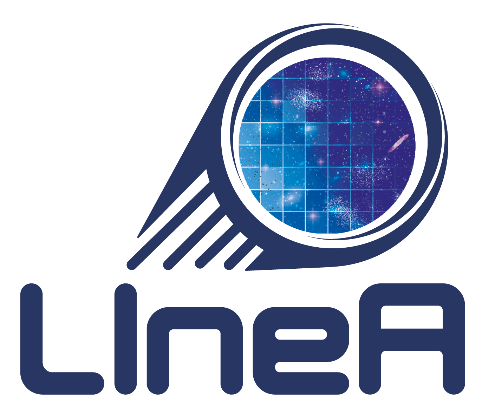

### UNDER CONSTRUCTION - EM CONSTRUÇÃO - EN CONSTRUCCIÓN 

--- 

    
    

This page will be an instance of **LSDB.io** service hosted at **LIneA**'s datacenter. 

[LSDB.io](https://data.lsdb.io) is a service to efficiently store and access large astronomical datasets, developed by the _LSST Interdiciplinary Network for Collaboration and Computing_ ([LINCC](https://lsstdiscoveryalliance.org/programs/lincc/)).

[LIneA](https//www.linea.org.br) (Laboratório Interinstitucional de e-Astronomia) is a Brazilian national laboratory for e-Astronomy with the mission to provide infrastructure and support for data-intensive astronomy in Brazil.

