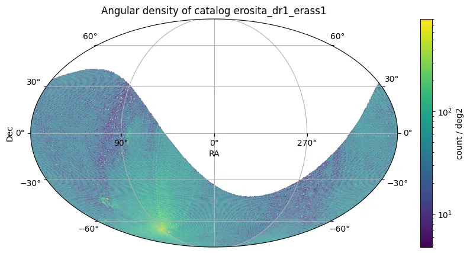

# eROSITA-DE DR1 Main

El conjunto de telescopios eROSITA a bordo del satélite Spektrum Roentgen Gamma (SRG) comenzó a sondear el cielo en diciembre de 2019. El Data Release 1 (DR1) presenta catálogos de rayos X, archivos de eventos calibrados, productos de fuentes y mapas de todo el cielo del primer Sondeo de Todo el Cielo eROSITA (eRASS1), que abarcó seis meses de operaciones de diciembre de 2019 a junio de 2020. Este lanzamiento comprende datos cubriendo el hemisferio galáctico occidental, la mitad del cielo propietaria del Consorcio Alemán eROSITA (eROSITA-DE).

Los datos del DR1 están organizados en 2447 tiles del cielo y proporcionan catálogos de fuentes en dos bandas primarias de rayos X: un catálogo principal del rango de energía más sensible de 0,2–2,3 keV, y un catálogo duro de la banda de 2,3–5,0 keV.

El catálogo principal eRASS1 resultante (0,2–2,3 keV) contiene 930.203 entradas (903.521 fuentes puntuales y 26.682 fuentes extendidas) seleccionadas con una probabilidad de detección DET_LIKE_0 ≥ 6 (o EXT_LIKE > 0). Un catálogo menor de 5.466 fuentes se presenta de la banda dura (2,3–5,0 keV), seleccionado con DET_LIKE_3 ≥ 12. Este catálogo principal eRASS1 aumenta el número de fuentes de rayos X conocidas en la literatura publicada en más del 60%.

Las principales métricas de rendimiento y características del sondeo incluyen:

* **HEW mediano de la PSF del sondeo (0,2–2,3 keV):** 30,0"
* **HEW mediano de la PSF del sondeo (2,3–5,0 keV):** 34,4"
* **Límite de flujo (0,5–2 keV, 50% de completitud):** F(0,5–2 keV) > 5 × 10⁻¹⁴ erg s⁻¹ cm⁻²
* **Precisión de flujo absoluto (0,5–2 keV):** ~6% de incertidumbre sistemática (relativo a XMM-Newton)
* **Incertidumbre sistemática astrométrica:** σ₀ = 0,9" ± 0,1" (basado en el cruce QSO Gaia/unWISE)
* **Fracción de fuentes espurias (Cat. Principal):** ~14% (para DET_LIKE_0 ≥ 6)
* **Fracción de fuentes espurias (Cat. Duro):** ~8–10% (para DET_LIKE_3 ≥ 12)
* **Fracción CXB resuelta (1–2 keV):** ~19% (valor mediano en el límite de flujo uniforme)

<figure class="dataset-figure">

<figcaption>Fuente de la imagen: https://data.lsdb.io</figcaption>
</figure>

## Cargar usando LSDB

```python
>>> lsdb.open_catalog('https://linea.data.lsdb.io/hats/erosita')
```

## Descargar con wget

```bash
$ wget -e robots=off -r -np -nH --cut-dirs=1 -c -R "index.html*" -l 0 https://linea.data.lsdb.io/hats/erosita/
```

## Metadatos del Catálogo

| Número de filas | Número de columnas | Número de particiones | Tamaño en disco |
|-----------------|-------------------|----------------------|-----------------|
| 930.203         | 255                | 10                   | 994 MB          |

<div class="button-container">
<a href="https://erosita.mpe.mpg.de/dr1" class="button-link">Lanzamiento Oficial</a>
<a href="https://erosita.mpe.mpg.de/dr1/AllSkySurveyData_dr1/Catalogues_dr1/MerloniA_DR1/eRASS1_Main.html" class="button-link">Descripciones de Columnas</a>
<a href="https://ui.adsabs.harvard.edu/abs/2024A%26A...682A..34M" class="button-link">Artículo de Investigación</a>
</div>
