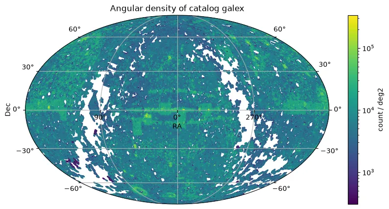

# GALEX Merged Catalog of Sources

El GALEX Merged Catalog of Sources (MCAT) es el catálogo principal de fuentes de la misión Galaxy Evolution Explorer (GALEX), operada por la NASA entre 2003 y 2012. El telescopio realizó levantamientos del cielo en dos bandas ultravioletas: far-UV (FUV, ~1350–1750 Å) y near-UV (NUV, ~1750–2800 Å).

El MCAT combina deteccciones de múltiples observaciones individuales (visitas) para generar una lista consolidada de fuentes únicas, proporcionando fotometría UV y propiedades básicas para centenas de millones de objetos. Cubre diferentes profundidades de levantamiento, desde el All-Sky Imaging Survey (AIS, más raso, cubriendo ~26.000 graus²) hasta el Deep Imaging Survey (DIS, más profundo, con exposiciones de decenas de miles de segundos).


<figure class="dataset-figure">

<figcaption>Source of the image: https://data.lsdb.io</figcaption>
</figure>


---

## Carga con LSDB

```bash
>> lsdb.open_catalog('https://linea.data.lsdb.io/hats/galex')
```

---

## Download con wget

```bash
$ wget -e robots=off -r -np -nH --cut-dirs=1 -c -R "index.html*" -l 0 https://linea.data.lsdb.io/hats/galex/
```

---

## Catalog Metadata

| Número de filas | úmero de columnas | úmero de particiones | Tamaño del disco | Versión del constructor          |
| ---------------- | ----------------- | ------------------- | ---------------- |---------------------------------|
| 292,296,119      | 368               | 1,595               | 343.7 GiB        | hats-import v0.9.2, hats v0.9.2 | 


<div class="button-container">
<a href="https://archive.stsci.edu/missions-and-data/galex" class="button-link">Liberación Oficial</a>
<a href="https://www.galex.caltech.edu/wiki/Public:Documentation/Appendix_A.1" class="button-link">Descripción de Columnas</a>
<a href="https://ui.adsabs.harvard.edu/abs/2017ApJS..230...24B/abstract" class="button-link">Artículo de Investigación</a>
</div>


