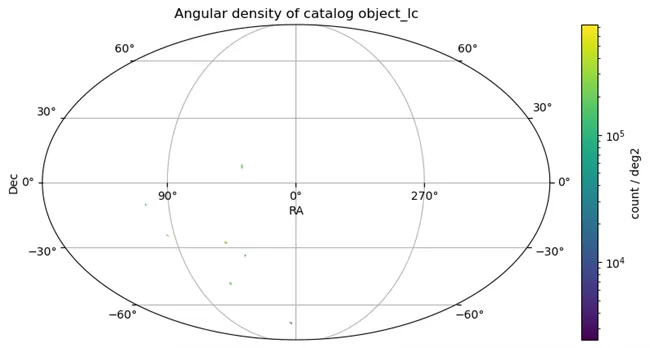

# Rubin Data Preview 1 (DP1) Object (lite)

El Legacy Survey of Space and Time (LSST) del Observatorio Vera C. Rubin es un estudio astronómico de 10 años diseñado para mapear todo el cielo del hemisferio sur con un nivel de detalle sin precedentes. Su objetivo es abordar preguntas clave sobre la energía oscura, la materia oscura, la estructura de la Vía Láctea y el sistema solar. Esta colección de catálogos fue generada por el pipeline DASH y es una versión reducida de la colección object. Aprende cómo acceder a los datos a través del enlace abajo.

<figure class="dataset-figure">

<figcaption>Fuente de la imagen: https://data.lsdb.io</figcaption>
</figure>

## Metadatos del Catálogo

| Número de filas     | Número de columnas | Número de particiones | Tamaño en disco |
|--------------------|-------------------|---------------------|--------------|
| 2,299,726        | 74                | 389               | 11 GiB        |

<a href="how_to_access_rubin_dp1.html" class="button-link">Cómo acceder a Rubin DP1</a>
<a href="https://sdm-schemas.lsst.io/dp1.html" class="button-link">Descripciones de Columnas</a>
<a href="https://rubinobs.atlassian.net/browse/DM-50260" class="button-link">Ticket en Jira</a>
<a href="https://github.com/lsst-sitcom/linccf/tree/main/dash" class="button-link">Pipeline DASH</a>
<a href="https://docs.lsdb.io/en/latest/citation.html" class="button-link">Cómo citar</a>

