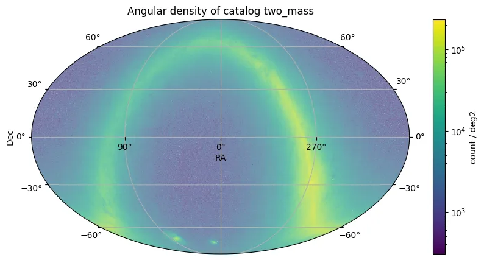

# Two Micron All Sky Survey (2MASS)

O Two Micron All Sky Survey (2MASS) coletou 25,4 Tbytes de dados de imagem brutos entre junho de 1997 e fevereiro de 2001, cobrindo 99,998% da esfera celeste nas bandas do infravermelho próximo J (1,25 μm), H (1,65 μm) e Ks (2,16 μm). As observações foram conduzidas usando dois telescópios dedicados de 1,3 m no Monte Hopkins, Arizona, e Cerro Tololo, Chile.

O lançamento de dados 2MASS All-Sky resultante compreende 4.121.439 imagens FITS e catálogos derivados do processamento final de dados. Os principais produtos de dados incluem um Catálogo de Fontes Pontuais de 470.992.970 fontes e um Catálogo de Fontes Estendidas de 1.647.599 objetos.

A pesquisa alcançou fotometria e astrometria uniformes e precisas. As principais métricas de desempenho para o Catálogo de Fontes Pontuais incluem:

* Sensibilidade (S/N=10): Melhor que J=15,8, H=15,1 e Ks=14,3 mag para virtualmente todo o céu.
* Confiabilidade: Maior que 99,95% para fontes com S/N ≥ 10 em qualquer banda.
* Completude: Maior que 99% para fontes com S/N ≥ 10 em qualquer banda.
* Precisão Fotométrica (Fontes Brilhantes): <0,03 mag (1σ).
* Precisão Astrométrica: ~100 mas (1σ) relativo ao ICRS.
* Faixa Dinâmica: >20 mag.

<figure class="dataset-figure">

<figcaption>Fonte da imagem: https://data.lsdb.io</figcaption>
</figure>

## Carregar usando LSDB

```python
>>> lsdb.open_catalog('https://linea.data.lsdb.io/hats/two_mass')
```

## Baixar com wget

```bash
$ wget -e robots=off -r -np -nH --cut-dirs=1 -c -R "index.html*" -l 0 https://linea.data.lsdb.io/hats/two_mass/
```

## Metadados do catálogo

| Número de linhas     | Número de colunas | Número de partições | Tamanho em disco |
|---------------------|-------------------|---------------------|------------------|
| 470,992,970         | 63                | 1,107               | 43 GB            |

<div class="button-container">
<a href="https://irsa.ipac.caltech.edu/data/2MASS/docs/releases/allsky/doc/sec2_2.html" class="button-link">Lançamento Oficial</a>
<a href="https://irsa.ipac.caltech.edu/data/2MASS/docs/releases/allsky/doc/sec2_2a.html" class="button-link">Descrições das Colunas</a>
<a href="https://ui.adsabs.harvard.edu/abs/2006AJ....131.1163S/abstract" class="button-link">Publicação Científica</a>
</div>
