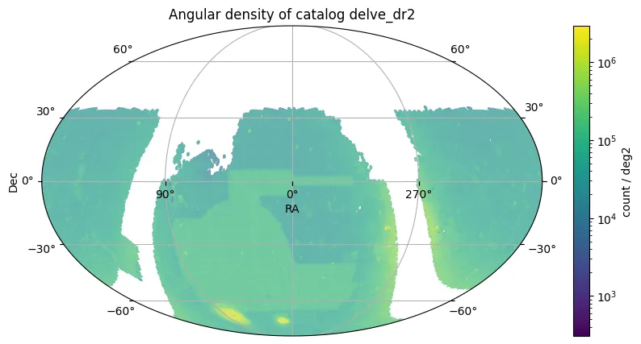

# O Levantamento DELVE – Data Release 2

O Levantamento DECam de Exploração do Volume Local – Data Release 2 (DELVE DR2) combina novas observações obtidas com a DECam com dados de arquivo provenientes do Levantamento de Energia Escura (DES), do Levantamento Legacy DECam (DECaLS) e de outros programas comunitários da DECam.
Seu principal objetivo científico é descobrir e caracterizar galáxias satélites pouco luminosas e outros sistemas estelares resolvidos individualmente no Volume Local.
O DELVE DR2 cobre mais de quatro vezes a área e contém cerca de cinco vezes mais objetos astronômicos em comparação com o lançamento anterior de dados.

---

## Cobertura do Levantamento e Catálogo

O levantamento reuniu aproximadamente 160.000 exposições (161.380 no total) de mais de 270 programas comunitários DECam. Ele cobre mais de 21.000 graus quadrados de céu, com foco em regiões de alta latitude galáctica (latitude galáctica absoluta maior que 10°).
Foram utilizados quatro filtros ópticos de banda larga e infravermelho próximo: *g, r, i* e *z*.

A sobreposição das quatro bandas cobre aproximadamente 17.000 graus quadrados (16.972 deg²) e fornece fotometria completa em quatro bandas para cerca de 618 milhões de fontes.
O catálogo total contém aproximadamente 2,5 bilhões de fontes, incluindo medições fotométricas por PSF e por abertura (AUTO).

---

## Métricas de Desempenho Principais

**Qualidade da imagem:**
A largura total à meia altura (FWHM) da função de espalhamento pontual (PSF) mediana varia por banda:
g = 1,24 arcsec, r = 1,10 arcsec, i = 1,02 arcsec, z = 1,00 arcsec.

**Sensibilidade (fotometria PSF, S/N = 5):**
Profundidade mediana de fonte pontual: g = 24,3 mag, r = 23,9 mag, i = 23,5 mag, z = 22,8 mag.

**Sensibilidade (fotometria AUTO, S/N = 5):**
Profundidade mediana por abertura: g = 23,9 mag, r = 23,5 mag, i = 23,0 mag, z = 22,4 mag.

**Precisão astrométrica:**
O deslocamento angular mediano em relação ao Gaia EDR3 é de 22 milissegundos de arco (mas).

**Repetibilidade fotométrica:**
O desvio quadrático médio (rms) mediano é de 4,9 mmag (banda g), 5,0 mmag (banda r), 4,5 mmag (banda i) e 5,4 mmag (banda z).

**Incerteza fotométrica absoluta:**
A precisão fotométrica absoluta estimada é de 20 mmag ou superior em todas as bandas.

<figure class="dataset-figure">

<figcaption>Fonte da imagem: https://data.lsdb.io</figcaption>
</figure>

---

## Carregar usando LSDB

```bash
>> lsdb.open_catalog('https://linea.data.lsdb.io/hats/delve_dr2')
```

---

## Download com wget

```bash
$ wget -e robots=off -r -np -nH --cut-dirs=1 -c -R "index.html*" -l 0 https://linea.data.lsdb.io/hats/delve_dr2/
```

---

## Metadados do Catálogo

| Número de linhas | Número de colunas | Número de partições | Tamanho em disco |
| ---------------- | ----------------- | ------------------- | ---------------- |
| 2.500.247.752    | 120               | 5.513               | 836 GiB          |

<div class="button-container">
<a href="https://datalab.noirlab.edu/data/delve" class="button-link">Lançamento Oficial</a>
<a href="https://datalab.noirlab.edu/data/delve" class="button-link">Descrições das Colunas</a>
<a href="https://arxiv.org/abs/2203.16565" class="button-link">Artigo de Pesquisa</a>
</div>
