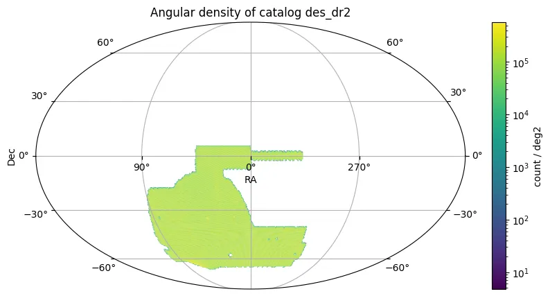

# Dark Energy Survey – Data Release 2

O Dark Energy Survey – Data Release 2 (DES DR2) apresenta imagens reduzidas de época única e coadicionadas, catálogos de fontes e produtos de dados associados de seis anos de operações científicas do DES (agosto de 2013–janeiro de 2019) utilizando a Dark Energy Camera (DECam) no telescópio Blanco de 4 m no Observatório Interamericano de Cerro Tololo, no Chile.

O DES DR2 compreende dados do levantamento de área ampla cobrindo aproximadamente 5000 deg² do hemisfério sul galáctico em cinco bandas fotométricas amplas (grizY). O lançamento consiste em 96.263 exposições de época única processadas em 10.169 imagens coadicionadas de 0,534 deg² cada, derivadas de 76.217 exposições de qualidade científica.

O catálogo resultante do DES DR2 contém 691.483.608 objetos astronômicos distintos detectados ao longo da área de cobertura. Após seleção básica de qualidade, as amostras de referência incluem 543 milhões de galáxias e 145 milhões de estrelas.

O levantamento alcançou fotometria uniforme e profunda, além de astrometria precisa. As principais métricas de desempenho incluem:

* **FWHM mediano da PSF**: g=1,11", r=0,95", i=0,88", z=0,83", Y=0,90"
* **Profundidade fotométrica** (abertura 1,95", S/N=10): g=24,7, r=24,4, i=23,8, z=23,1, Y=21,7 mag
* **Limite de completude 95%**: g=24,6, r=24,3, i=24,0, z=23,7, Y=23,4 mag
* **Uniformidade fotométrica**: <3 mmag (1σ) relativo à banda G do Gaia DR2
* **Precisão fotométrica absoluta**: ~11 mmag de incerteza sistemática
* **Precisão astrométrica**: ~27 mas (1σ) de precisão interna na coadição
* **Taxa de objetos espúrios**: ~1%
* **Separação estrela-galáxia**: >99% de eficiência para galáxias, >94% de eficiência para estrelas em 19,0<i<22,5

O DES DR2 constitui o maior conjunto de dados fotométricos até hoje na profundidade e precisão fotométrica alcançadas.

<figure class="dataset-figure">

<figcaption>Fonte da imagem: https://data.lsdb.io</figcaption>
</figure>

## Carregar usando LSDB

```python
>>> lsdb.open_catalog('https://linea.data.lsdb.io/hats/des2/des_dr2')
```

## Download com wget

```bash
$ wget -e robots=off -r -np -nH --cut-dirs=2 -c -R "index.html*" -l 0 https://linea.data.lsdb.io/hats/des2/des_dr2/
```

## Metadados do Catálogo

| Número de linhas | Número de colunas | Número de partições | Tamanho em disco |
|------------------|-------------------|---------------------|------------------|
| 662.428.385      | 215               | 1.523               | 667 GB           |

<div class="button-container">
<a href="https://www.darkenergysurvey.org/dr2/" class="button-link">Lançamento Oficial</a>
<a href="https://des.ncsa.illinois.edu/releases/dr2/dr2-access" class="button-link">Descrições das Colunas</a>
<a href="https://arxiv.org/abs/2101.05765" class="button-link">Artigo de Pesquisa</a>
</div>
