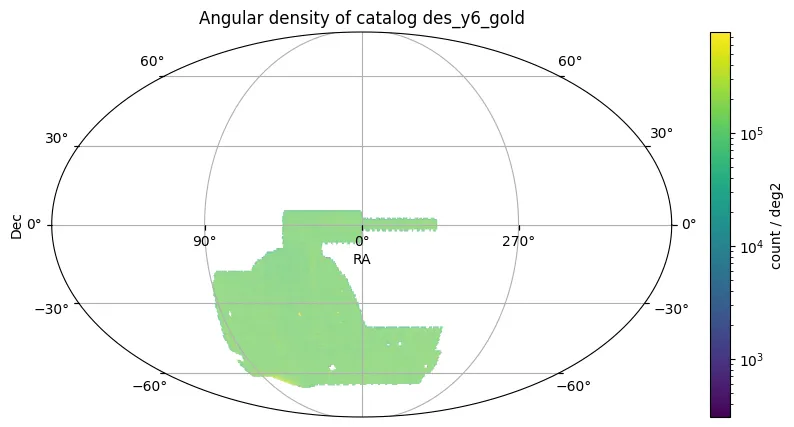

# Dark Energy Survey Y6 Gold

O Dark Energy Survey Year 6 (DES Y6) Gold apresenta um conjunto de dados fotométricos curados derivado dos seis anos completos de observações do DES (agosto de 2013–janeiro de 2019) utilizando a Dark Energy Camera no telescópio Blanco de 4m no Observatório Interamericano de Cerro Tololo, Chile, especificamente otimizado para análises de cosmologia de céu estático.

O DES Y6 Gold é montado a partir do Dark Energy Survey Data Release 2 e compreende aproximadamente 5000 deg² de imagens grizY no hemisfério sul galáctico. O conjunto de dados incorpora fotometria multi-época avançada, calibração aprimorada, classificação de objetos melhorada e produtos auxiliares abrangentes, incluindo máscaras de cobertura, mapas de propriedades do levantamento e estimativas de redshift fotométrico.

O catálogo resultante Y6 Gold contém 669 milhões de objetos de alta qualidade detectados ao longo da área de cobertura do levantamento. Após seleções de qualidade, as amostras de referência incluem 448 milhões de galáxias e 120 milhões de estrelas.

O levantamento alcançou fotometria uniforme e profunda com astrometria precisa e classificação robusta de objetos. As principais métricas de desempenho incluem:

* **FWHM mediano da PSF**: g=1,13", r=0,99", i=0,90", z=0,87", Y=0,93"
* **Cobertura do Levantamento**: 4923 deg² (requerendo ≥2 exposições em griz)
* **Profundidade fotométrica** (abertura 1,95", S/N=10): g=24,7, r=24,4, i=23,8, z=23,1, Y=21,7 mag
* **Profundidade de galáxias multi-época** (S/N=10, modelo BDF): i=23,4 mag
* **Limite de completude 90%** (objetos estendidos): g=23,9, r=23,2, i=22,7, z=22,4 mag
* **Uniformidade fotométrica**: <2 mmag relativo à banda G do Gaia
* **Precisão astrométrica**: ~27 mas (precisão interna mediana)
* **Classificação estrela-galáxia** (17,5≤i≤22,5): Eficiência de galáxias 98,6% com 0,8% de contaminação; Eficiência estelar 94,6% com 1,5% de contaminação
* **Densidade de objetos**: 37,4 arcmin⁻² no total; 28,9 arcmin⁻² para galáxias de alta confiança

<figure class="dataset-figure">

<figcaption>Fonte da imagem: https://data.lsdb.io</figcaption>
</figure>

## Carregar usando LSDB

```python
>>> lsdb.open_catalog('https://linea.data.lsdb.io/hats/des/des_y6_gold')
```

## Download com wget

```bash
$ wget -e robots=off -r -np -nH --cut-dirs=2 -c -R "index.html*" -l 0 https://linea.data.lsdb.io/hats/des/des_y6_gold/
```

## Metadados do Catálogo

| Número de linhas | Número de colunas | Número de partições | Tamanho em disco |
|------------------|-------------------|---------------------|------------------|
| 691.483.608      | 336               | 1.582               | 1,3 TiB          |

<div class="button-container">
<a href="https://des.ncsa.illinois.edu/releases/y6a2/Y6gold" class="button-link">Lançamento Oficial</a>
<a href="https://des.ncsa.illinois.edu/releases/y6a2/Y6gold" class="button-link">Descrições das Colunas</a>
<a href="https://arxiv.org/abs/2501.05739" class="button-link">Artigo Científico</a>
</div>
