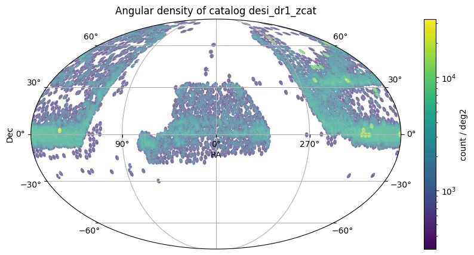

# Dark Energy Spectroscopic Instrument Data Release 1

O Dark Energy Spectroscopic Instrument (DESI) Data Release 1 (DR1) apresenta dados espectroscópicos dos primeiros 13 meses do levantamento principal do DESI (14 de maio de 2021 até 13 de junho de 2022), juntamente com um reprocessamento uniforme de todos os dados de Validação do Levantamento (SV). O DESI é um espectrógrafo altamente multiplexado montado no telescópio Mayall de 4 metros no Observatório Nacional de Kitt Peak, capaz de observar simultaneamente 5000 alvos em um campo de visão de 8 deg² usando posicionamento robótico de fibras.

O DR1 compreende observações em 14.000 deg² dos hemisférios norte e sul galácticos em comprimentos de onda ópticos (3600-9800 Å) abrangendo cinco classes amplas de alvos: estrelas do Milky Way Survey (MWS), galáxias do Bright Galaxy Survey (BGS, 0<z<0,6), galáxias vermelhas luminosas (LRGs, 0,4<z<1,1), galáxias de linha de emissão (ELGs, 0,6<z<1,6) e quasares (QSOs, 0,9<z<4). A produção espectroscópica principal para o DR1 é o Iron, processado usando algoritmos de calibração melhorados e modelos de QSO atualizados em comparação com o lançamento EDR anterior.

O catálogo resultante DR1 contém redshifts de alta confiança para 18,7 milhões de objetos únicos em todos os levantamentos e programas, tornando o DR1 o maior levantamento espectroscópico de redshift extragaláctico já realizado—quase quatro vezes maior que todos os programas SDSS anteriores combinados. O levantamento principal inclui 8,5 milhões, 9,0 milhões e 1,2 milhões de objetos dos programas bright, dark e backup, respectivamente. Após aplicar critérios de qualidade (ZWARN=0), a amostra compreende 13,1 milhões de galáxias, 1,6 milhão de quasares e 4 milhões de estrelas. A tabela z-catalog do DESI DR1 é um catálogo consolidado de redshifts, classificações espectrais e metadados de observação (com flag/coluna para o “melhor” redshift por alvo). 

As principais métricas de desempenho e características do levantamento incluem:

* **Cobertura Espectroscópica**: 9739 deg² (programa bright), 9528 deg² (programa dark), 2726 deg² (programa backup)
* **Completude do Levantamento** (no final do período DR1): 41,3% (bright), 29,0% (dark), 5,2% (backup)
* **Precisão de Comprimento de Onda**: 0,025 Å
* **Calibração Espectrofotométrica**: 6-10% de incerteza sistemática
* **Precisão de Redshift**: 10 km s⁻¹ (BGS, ELG), 50 km s⁻¹ (LRG), 20-125 km s⁻¹ (QSO)
* **Taxa de Outliers de Redshift**: ≤0,3% (BGS, LRG, ELG), 0,7% (QSO z<2,1), 1,8% (QSO z>2,1)
* **Precisão de Velocidade Radial** (MWS): ≲10 km s⁻¹
* **Resíduos de Subtração do Céu**: <1% sistemático
* **Resolução Instrumental**: λ/Δλ = 2000-5200 (dependente do comprimento de onda)

<figure class="dataset-figure">

<figcaption>Fonte da imagem: https://data.lsdb.io</figcaption>
</figure>

## Carregar usando LSDB

```python
>>> lsdb.open_catalog('https://linea.data.lsdb.io/hats/desi/desi_dr1_zcat')
```

## Download com wget

```bash
$ wget -e robots=off -r -np -nH --cut-dirs=2 -c -R "index.html*" -l 0 https://linea.data.lsdb.io/hats/desi/desi_dr1_zcat/
```

## Metadados do Catálogo

| Número de linhas | Número de colunas | Número de partições | Tamanho em disco |
|------------------|-------------------|---------------------|------------------|
| 28.425.963       | 136               | 75                  | 12 GiB           |

<div class="button-container">
<a href="https://data.desi.lbl.gov/doc/releases/dr1" class="button-link">Lançamento Oficial</a>
<a href="https://desidatamodel.readthedocs.io/en/latest/column_descriptions.html" class="button-link">Descrições das Colunas</a>
<a href="https://ui.adsabs.harvard.edu/abs/2025arXiv250314745D" class="button-link">Artigo Científico</a>
</div>

## Agradecimentos

A pesquisa utilizou dados do DESI. A construção e operação do DESI são gerenciadas pelo Lawrence Berkeley National Laboratory. Trabalho apoiado pelo Departamento de Energia dos EUA, Escritório de Ciência, Escritório de Física de Alta Energia (Contrato No. DE-AC02-05CH11231) e pelo Centro Nacional de Computação Científica de Pesquisa em Energia.

Apoio adicional de:

- Fundação Nacional de Ciência dos EUA (NSF), Divisão de Ciências Astronômicas (Contrato No. AST-0950945)
- Laboratório Nacional de Pesquisa em Astronomia Óptica-Infravermelha da NSF
- Conselho de Instalações de Ciência e Tecnologia do Reino Unido
- Fundação Gordon e Betty Moore
- Fundação Heising-Simons
- Comissão Francesa de Energias Alternativas e Energia Atômica (CEA)
- Conselho Nacional de Humanidades, Ciência e Tecnologia do México (CONAHCYT)
- Ministério da Ciência e Inovação da Espanha (MICINN)
- Instituições Membros do DESI (www.desi.lbl.gov/collaborating-institutions)

A colaboração DESI tem permissão para conduzir pesquisa científica em I'oligam Du'ag (Kitt Peak), uma montanha significativa para a Nação Tohono O'odham.

Opiniões, descobertas e conclusões são dos autores e não refletem necessariamente as opiniões da Fundação Nacional de Ciência dos EUA, Departamento de Energia dos EUA ou agências de financiamento listadas.
