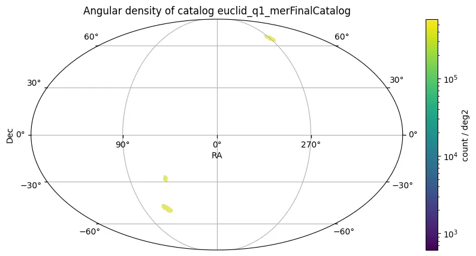

# Euclid Quick Data Release 1

A missão Euclid, uma missão espacial da ESA voltada principalmente para o estudo de matéria escura e energia escura usando lente gravitacional fraca e agrupamento de galáxias, iniciou suas operações nominais de levantamento amplo em fevereiro de 2024. O primeiro Euclid Quick Data Release (Q1), disponibilizado publicamente em março de 2025, fornece uma visão inicial das capacidades do levantamento. O Q1 compreende dados de imagem e espectroscopia espaciais visíveis e infravermelhos próximos do instrumento VIS e do Espectrômetro e Fotômetro Infravermelho Próximo (NISP), suplementados por fotometria terrestre nas bandas u, g, r, i e z, processados com versões iniciais dos pipelines do Euclid.

O Q1 abrange 63,1 graus quadrados cobrindo três Campos Profundos Euclid (EDF-N, EDF-S, EDF-F) observados até a profundidade nominal de visita única do Euclid Wide Survey (EWS). Os dados incluem imagens nas bandas VIS (IE) e NISP (YE, JE, HE), bem como espectroscopia sem fenda do NISP usando o grism vermelho (1,206–1,892 µm). Os dados terrestres originam-se principalmente do levantamento UNIONS para EDF-N e do Dark Energy Survey (DES) e outras observações DECam para EDF-S e EDF-F. O Q1 também inclui observações mais profundas (cerca de 17 vezes a exposição EWS) de uma área de 0,5 grau quadrado na nuvem escura LDN 1641.

O catálogo Q1 contém aproximadamente 30 milhões de objetos nas três áreas EDF.

As principais métricas de desempenho e características do levantamento incluem:

* **Resolução Espacial VIS:** 0,18"
* **Resolução Espacial NISP:** 0,3" por pixel
* **Profundidade Fotométrica (Terrestre, 10σ, abertura 2", típica para EDF-N):** g ≈ 25,3, r ≈ 24,3, i ≈ 23,7, z ≈ 23,6 mag
* **Quadro de Calibração Astrométrica:** Gaia DR3
* **Quadro de Calibração Fotométrica Absoluta:** HST CALSPEC
* **Dispersão Fotométrica Interna (Coadições terrestres vs sintética Gaia):** ~1% (NMAD)
* **Alvos Espectroscópicos:** Fontes com HE ≤ 22,5
* **Taxa de Sucesso de Redshift Espectroscópico:** Esperada abaixo de 10% para medições automatizadas no processamento Q1

<figure class="dataset-figure">

<figcaption>Fonte da imagem: https://data.lsdb.io</figcaption>
</figure>

## Carregar usando LSDB

```python
>>> lsdb.open_catalog('https://linea.data.lsdb.io/hats/euclid_q1')
```

## Download com wget

```bash
$ wget -e robots=off -r -np -nH --cut-dirs=1 -c -R "index.html*" -l 0 https://linea.data.lsdb.io/hats/euclid_q1/
```

## Metadados do Catálogo

| Número de linhas | Número de colunas | Número de partições | Tamanho em disco |
|------------------|-------------------|---------------------|------------------|
| 29.767.806       | 472               | 85                  | 23 GiB           |

<div class="button-container">
<a href="https://www.cosmos.esa.int/en/web/euclid/euclid-q1-data-release" class="button-link">Lançamento Oficial</a>
<a href="https://euclid.esac.esa.int/dr/q1/dpdd/merdpd/dpcards/mer_finalcatalog.html#detailed-description-of-the-data-product" class="button-link">Descrições das Colunas</a>
<a href="https://ui.adsabs.harvard.edu/abs/2025arXiv250315302E/abstract" class="button-link">Artigo Científico</a>
</div>
