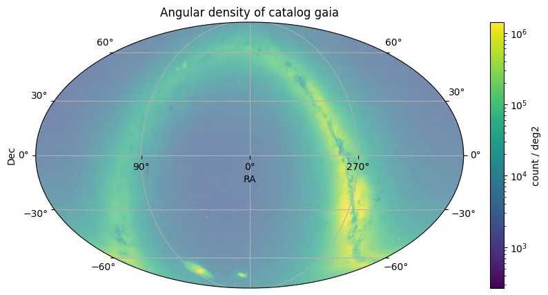

# Gaia Data Release 3

O Gaia Data Release 3 (DR3) apresenta uma atualização significativa dos dados da missão Gaia da Agência Espacial Europeia, expandindo substancialmente o Early Third Data Release (Gaia EDR3). Embora repita a astrometria (posições, paralaxes, movimentos próprios) e fotometria de banda larga (G, GBP, GRP) para aproximadamente 1,8 bilhão de fontes do Gaia EDR3, o Gaia DR3 introduz uma riqueza de novas informações astrofísicas derivadas dos primeiros 34 meses de dados da missão. Este lançamento constitui a maior coleção até hoje de espectrofotometria de todo o céu, velocidades radiais, informações de variabilidade e parâmetros astrofísicos.

O catálogo Gaia DR3 incorpora dados do instrumento astrométrico do Gaia (banda G: 330–1050 nm), dos fotômetros BP/RP (fornecendo espectros de baixa resolução cobrindo 330–680 nm e 640–1050 nm, respectivamente) e do Espectrômetro de Velocidade Radial (RVS, cobrindo 846–870 nm). A lista de fontes permanece idêntica ao Gaia EDR3.

O catálogo fornece novas velocidades radiais médias para mais de 33 milhões de objetos, espectros médios BP/RP para cerca de 220 milhões de fontes e espectros médios RVS para aproximadamente 1 milhão de fontes. A análise da fotometria de época produz classificações e parâmetros para cerca de 10 milhões de fontes variáveis em 24 tipos. Parâmetros astrofísicos são fornecidos para aproximadamente 470 milhões de fontes, com probabilidades de classe de objeto para cerca de 1,5 bilhão de fontes. Além disso, soluções orbitais ou parâmetros de tendência estão disponíveis para aproximadamente 800.000 estrelas não-simples, e dados para mais de 150.000 objetos do Sistema Solar estão incluídos.

As principais métricas de desempenho e características do levantamento incluem:

* **Período de Observação:** 34 meses
* **Quadro de Referência Astrométrica:** Gaia-CRF3 (alinhado com ICRF3 para ~0,01 mas RMS em J2016.0)
* **Viés Global de Paralaxe:** –17 µas
* **Resolução Espectral BP/RP (R = λ/Δλ):** ~30–100 (BP), ~70–100 (RP)
* **Resolução Espectral RVS (R = λ/Δλ):** ~11.500
* **Faixa de Comprimento de Onda RVS (processada):** 846–870 nm
* **Limite de Magnitude de Velocidade Radial:** GRVS < 14
* **Faixa de Temperatura de Velocidade Radial:** 3100 ≤ Teff ≤ 14.500 K
* **Limite de Magnitude dos Espectros Médios BP/RP:** Principalmente G < 17,65

<figure class="dataset-figure">

<figcaption>Fonte da imagem: https://data.lsdb.io</figcaption>
</figure>

## Carregar usando LSDB

```python
>>> lsdb.open_catalog('https://linea.data.lsdb.io/hats/gaia_dr3')
```

## Download com wget

```bash
$ wget -e robots=off -r -np -nH --cut-dirs=1 -c -R "index.html*" -l 0 https://linea.data.lsdb.io/hats/gaia_dr3/
```

## Metadados do Catálogo

| Número de linhas | Número de colunas | Número de partições | Tamanho em disco |
|------------------|-------------------|---------------------|------------------|
| 1.812.731.847    | 152               | 2.016               | 1,1 TiB         |

<div class="button-container">
<a href="https://www.cosmos.esa.int/web/gaia/dr3" class="button-link">Lançamento Oficial</a>
<a href="https://gea.esac.esa.int/archive/documentation/GDR3/Gaia_archive/chap_datamodel/sec_dm_main_source_catalogue/ssec_dm_gaia_source.html" class="button-link">Descrições das Colunas</a>
<a href="https://ui.adsabs.harvard.edu/abs/2022arXiv220800211G/abstract" class="button-link">Artigo de Pesquisa</a>
</div>
